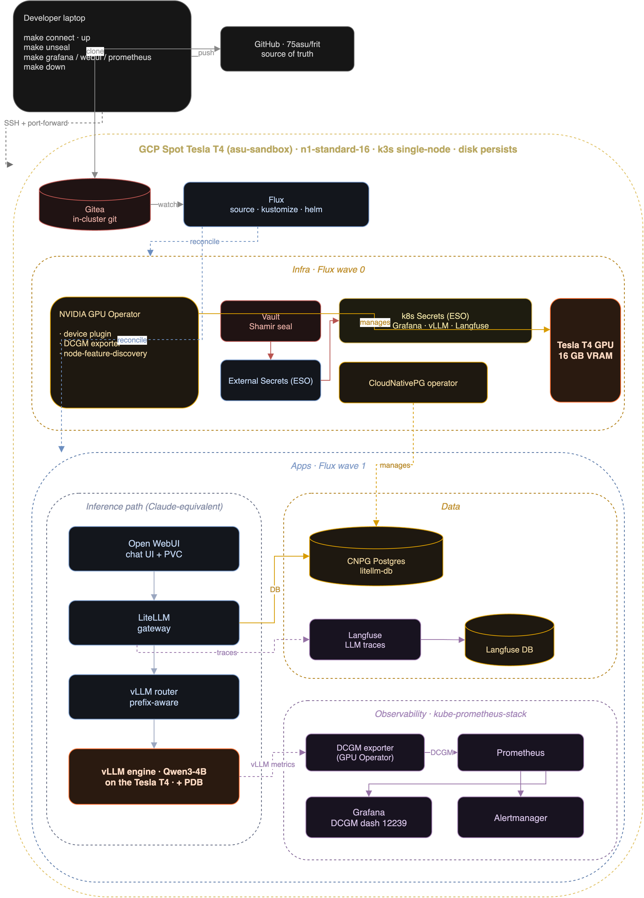

# frit

GPU reliability engineering at homelab scale. One GPU, the full inference stack, and the reliability practices that hold at 1000.

**M0 shipped · M2 shipped · M3 active** -- live status at [75asu.github.io/frit](https://75asu.github.io/frit)

---

## What it is

A public lab that runs a frontier-lab-style inference stack on a single NVIDIA GPU, then practices the work that actually matters at fleet scale: GPU observability, SLOs, load testing, chaos, and postmortems. Every milestone ships a real artifact.

| Production platform | frit equivalent |
|---|---|
| Chat UI (Claude.ai, ChatGPT) | Open WebUI |
| Model API gateway | LiteLLM |
| Model serving | vLLM + Qwen3-4B on a Tesla T4 |
| GPU observability | DCGM + Prometheus + Grafana |

## Architecture

One GCP Spot Tesla T4, single-node k3s, reconciled by Flux (GitOps). The request path mirrors a production serving stack -- Open WebUI to LiteLLM to vLLM to Qwen3-4B -- with a CloudNativePG data tier, Vault/ESO secrets, and the kube-prometheus stack.

<div align="center">
<picture>
  <source media="(prefers-color-scheme: dark)" srcset="docs/architecture-dark.png">
  <source media="(prefers-color-scheme: light)" srcset="docs/architecture-light.png">
  
</picture>
</div>

<sub>Source: [`docs/architecture.drawio`](docs/architecture.drawio) -- regenerate both themes with `make diagram`.</sub>

## Milestones

| # | Milestone | Status |
|---|---|---|
| M0 | GPU foundation -- driver, DCGM, k3s, GPU-in-k8s | **shipped** |
| M1 | GPU metrics exporter -- NVML to Prometheus, Go | queued |
| M2 | Observability stack -- GPU Operator + kube-prometheus via Flux | **shipped** |
| M3 | Inference layer -- vLLM + LiteLLM + Open WebUI, TTFT dashboard | **active** |
| M4 | SLOs + alerting -- error budgets, burn-rate alerts | queued |
| M5 | Multi-platform simulation -- canary routing, equivalence checks | queued |
| M6 | Load testing -- ramp / soak / spike, breaking point | queued |
| M7 | Chaos + postmortems -- experiments and blameless writeups | queued |
| M8 | OSS cadence -- ops reviews, merged upstream PRs | queued |

## Stack

- **Inference** -- vLLM, LiteLLM, Open WebUI
- **Observability** -- DCGM, Prometheus, Grafana, Alertmanager
- **Platform** -- k3s + Flux (GitOps), Vault + External Secrets, CloudNativePG
- **GPU** -- NVIDIA Tesla T4 (16 GB); any NVIDIA GPU works

<details>
<summary><b>Quick start</b> -- bare VM to a running, observable stack, one command per step</summary>

Bring any NVIDIA GPU VM (a GCP Spot T4 is the reference; any Ubuntu host with a GPU works). No secrets touch git -- `.env` and the rendered inventory are gitignored.

```bash
git clone https://github.com/75asu/frit.git && cd frit
cp .env.example .env        # GCP coords + TARGET_USER/SSH_KEY_PATH + secrets

make up                     # connect + gpu + k3s + bootstrap (Flux applies gitops/)
make tunnel                 # forward the k3s API, then:
make kubectl CMD="get pods -A"
make grafana                # open Grafana / Open WebUI over SSH (also: make webui)

make down                   # stop the VM -- disk + cluster persist (make up restores)
make teardown               # wipe back to bare Ubuntu, no residue
```

Run `make help` for the full command list.

</details>

---

Apache-2.0 -- by [@75asu](https://75asu.pages.dev)
